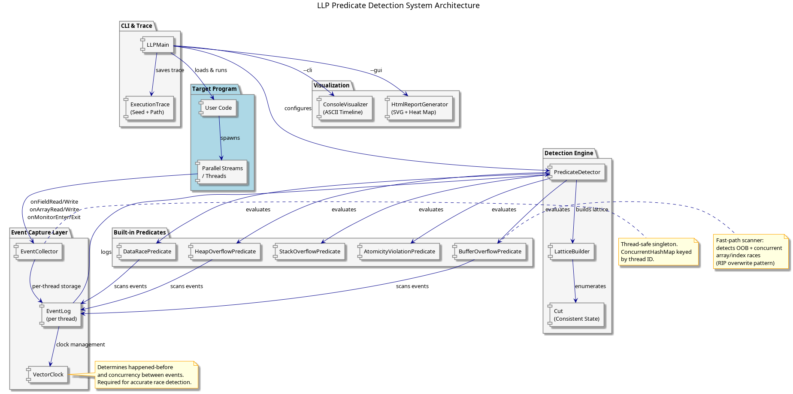
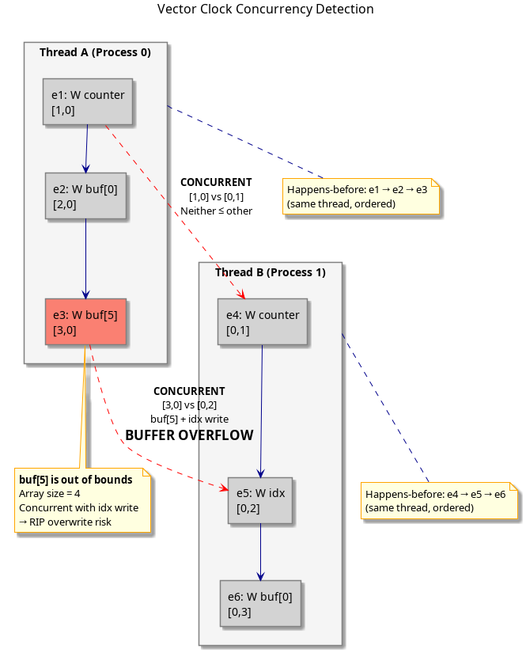
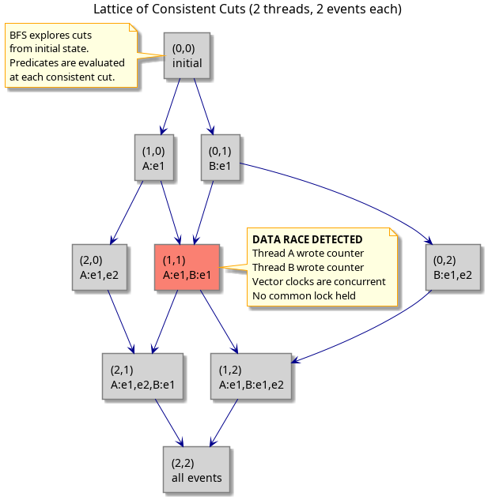
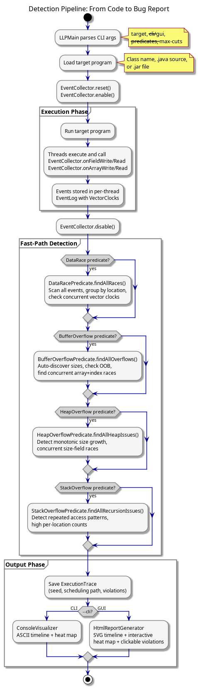
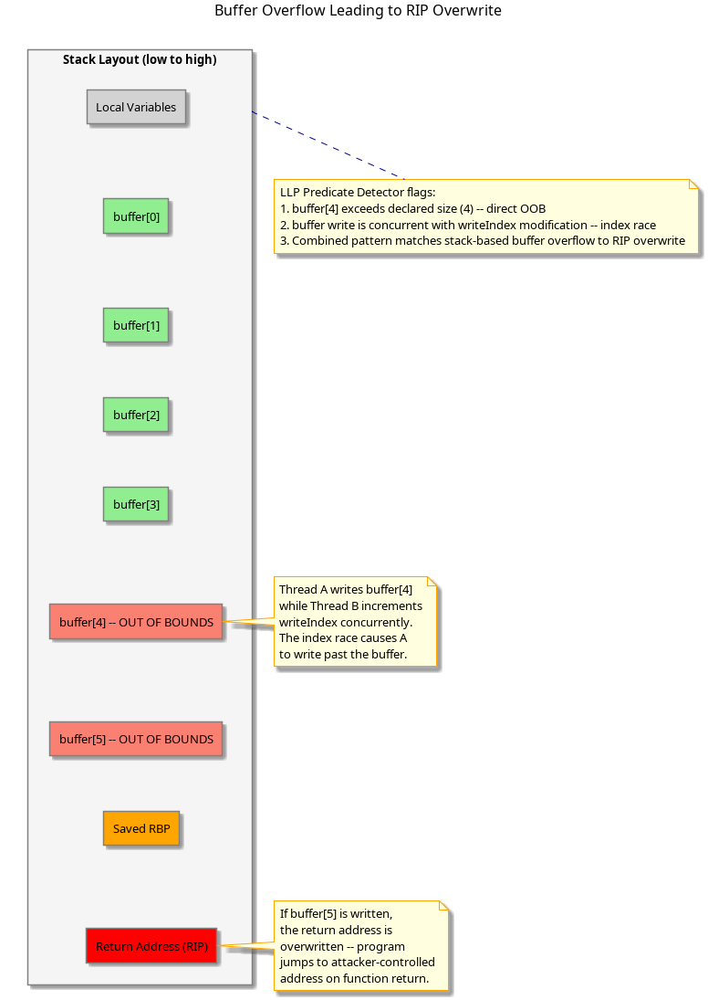
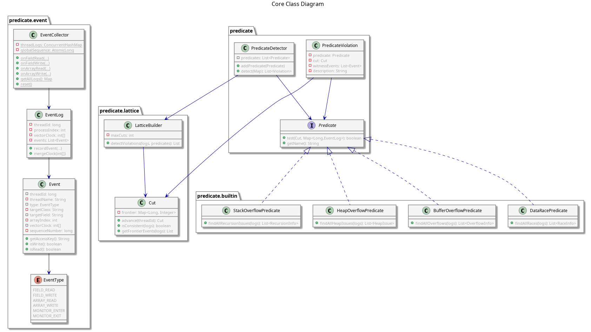

# Technical Deep Dive: LLP Predicate Detection System

## Table of Contents

1. [Introduction](#1-introduction)
2. [System Architecture](#2-system-architecture)
3. [Event Capture Layer](#3-event-capture-layer)
   - 3.1 [EventCollector](#31-eventcollector)
   - 3.2 [EventLog and Per-Thread Storage](#32-eventlog-and-per-thread-storage)
   - 3.3 [Event Types](#33-event-types)
4. [Vector Clocks and Happened-Before Ordering](#4-vector-clocks-and-happened-before-ordering)
   - 4.1 [Why Vector Clocks, Not Lamport Timestamps](#41-why-vector-clocks-not-lamport-timestamps)
   - 4.2 [Concurrency Detection](#42-concurrency-detection)
5. [The Lattice of Consistent Cuts](#5-the-lattice-of-consistent-cuts)
   - 5.1 [What Is a Cut](#51-what-is-a-cut)
   - 5.2 [Lattice Traversal via BFS](#52-lattice-traversal-via-bfs)
   - 5.3 [Explosion Mitigation](#53-explosion-mitigation)
6. [Detection Pipeline](#6-detection-pipeline)
   - 6.1 [Two-Phase Detection](#61-two-phase-detection)
   - 6.2 [Fast-Path Scanners](#62-fast-path-scanners)
7. [Built-in Predicates](#7-built-in-predicates)
   - 7.1 [DataRacePredicate](#71-dataracepredicate)
   - 7.2 [BufferOverflowPredicate](#72-bufferoverflowpredicate)
   - 7.3 [HeapOverflowPredicate](#73-heapoverflowpredicate)
   - 7.4 [StackOverflowPredicate](#74-stackoverflowpredicate)
   - 7.5 [AtomicityViolationPredicate](#75-atomicityviolationpredicate)
8. [Buffer Overflow and RIP Overwrite Detection](#8-buffer-overflow-and-rip-overwrite-detection)
9. [Visualization System](#9-visualization-system)
   - 9.1 [Console Visualizer](#91-console-visualizer)
   - 9.2 [Interactive HTML Report](#92-interactive-html-report)
10. [Execution Trace and Reproducibility](#10-execution-trace-and-reproducibility)
11. [Class Diagram](#11-class-diagram)
12. [Performance Considerations](#12-performance-considerations)
13. [Limitations and Future Work](#13-limitations-and-future-work)

---

## 1. Introduction

The LLP Predicate Detection System is a Java-based framework for finding concurrency bugs that are difficult to reproduce through conventional testing. It implements the Linear Lattice Predicate (LLP) detection algorithm from Vijay K. Garg's foundational work on predicate detection in distributed and concurrent systems, adapted for modern Java programs that use parallel streams, thread pools, and shared mutable state.

Traditional testing executes a program once and checks the output. Concurrency bugs, however, depend on the specific interleaving of threads -- a data race might only manifest under one of thousands of possible schedules. The LLP approach addresses this by observing a single execution, recording events with vector clocks, and then systematically exploring the lattice of all consistent global states that *could have* occurred given those events. This allows the detector to find bugs that didn't crash the program in the observed run but would crash it under a different thread schedule.

This document provides a technical deep dive into the system's architecture, algorithms, and design decisions. It assumes familiarity with concurrent programming, Java, and basic distributed systems concepts.

---

## 2. System Architecture

The system is organized into four distinct layers, each with a clear responsibility boundary. The target program runs unmodified except for event-recording calls, the capture layer collects and timestamps events, the detection engine explores the state space, and the visualization layer presents results to the developer.

The architecture follows a pipeline pattern: events flow from the target program through the collector into per-thread logs, which are then consumed by the detection engine after execution completes. This offline analysis approach was chosen deliberately over online detection because the lattice of consistent cuts can grow exponentially with the number of threads and events, making real-time traversal impractical for programs with even moderate concurrency.

The separation between event capture and detection also means the system can be extended with new predicates without modifying the instrumentation layer. A developer implementing a custom predicate only needs to implement the `Predicate` interface and define what constitutes a violation in terms of events at a consistent cut.

---

## 3. Event Capture Layer

### 3.1 EventCollector

The `EventCollector` is a static singleton that serves as the single entry point for all instrumented code. It uses a `ConcurrentHashMap<Long, EventLog>` keyed by thread ID to achieve lock-free per-thread event storage. When a thread records its first event, `computeIfAbsent` atomically creates a new `EventLog` and assigns it a unique process index for vector clock management.

The collector exposes six recording methods corresponding to the observable operations in a concurrent Java program:

| Method | Records |
|--------|---------|
| `onFieldRead(class, field, value)` | A thread reading an object field |
| `onFieldWrite(class, field, old, new)` | A thread writing an object field |
| `onArrayRead(class, field, index, value)` | A thread reading an array element |
| `onArrayWrite(class, field, index, old, new)` | A thread writing an array element |
| `onMonitorEnter(class, lockId)` | A thread acquiring a lock |
| `onMonitorExit(class, lockId)` | A thread releasing a lock |

Each call increments a global `AtomicLong` sequence counter, providing a total order on events across all threads. This sequence number is distinct from the vector clock -- it records the *observed* order, while the vector clock captures the *causal* order. The distinction matters: two events that are concurrent in the vector clock sense may still have different sequence numbers simply because one was physically observed before the other.

### 3.2 EventLog and Per-Thread Storage

Each thread gets its own `EventLog` instance, which stores events in an `ArrayList<Event>` and maintains that thread's vector clock. Because only the owning thread writes to its log during the execution phase, no synchronization is needed on the write path. Reading happens after execution completes, when the detection engine consumes the logs.

The vector clock is initialized with size equal to the number of known threads, but grows dynamically as new threads appear via `growClock()`. When a thread synchronization event occurs (e.g., `Thread.join()`), `mergeClock()` takes the element-wise maximum of the current thread's clock and the joined thread's clock, establishing the happens-before edge.

### 3.3 Event Types

Events are classified into six types, captured in the `EventType` enum. The distinction between field and array operations is important because buffer overflow detection requires knowing the array index. Monitor operations are tracked separately because they establish happens-before edges and are used by the data race predicate to determine whether two accesses are protected by a common lock.

Each `Event` is immutable after construction and stores a defensive copy of the vector clock at the time of recording. This ensures that subsequent clock updates don't retroactively change the event's causal ordering, which would invalidate the detection results.

---

## 4. Vector Clocks and Happened-Before Ordering

### 4.1 Why Vector Clocks, Not Lamport Timestamps

A Lamport timestamp assigns a single integer to each event such that if event A happens-before event B, then `timestamp(A) < timestamp(B)`. However, the converse is not true: `timestamp(A) < timestamp(B)` does not imply that A happened before B. This means Lamport timestamps cannot determine whether two events are concurrent -- they can only rule out concurrency when the timestamps are equal.

Vector clocks solve this. A vector clock is an array of integers, one per process. For two events with vector clocks `V(A)` and `V(B)`:

- **A happens-before B** if `V(A)[i] <= V(B)[i]` for all `i`, and at least one is strictly less.
- **A and B are concurrent** if neither happens-before the other.

This distinction is the foundation of data race detection. A data race exists when two events access the same memory location, at least one is a write, and their vector clocks are concurrent.

### 4.2 Concurrency Detection

The `VectorClock` utility class provides pure static functions for clock arithmetic. The key operation is `concurrent(int[] a, int[] b)`, which returns true when neither `happensBefore(a, b)` nor `happensBefore(b, a)` is true, and the clocks are not equal.

In the diagram above, Thread A's events have vector clocks `[1,0]`, `[2,0]`, `[3,0]` and Thread B's events have `[0,1]`, `[0,2]`, `[0,3]`. Event `e1` (`[1,0]`) and event `e4` (`[0,1]`) are concurrent because neither `[1,0] <= [0,1]` nor `[0,1] <= [1,0]`. This means the system correctly identifies that these two writes to `counter` could have happened in either order -- a data race.

The critical insight for buffer overflow detection is that event `e3` (writing `buf[5]` at `[3,0]`) is concurrent with event `e5` (writing `idx` at `[0,2]`). This concurrent array access plus index modification is the pattern that produces buffer overflows leading to RIP overwrites.

---

## 5. The Lattice of Consistent Cuts

### 5.1 What Is a Cut

A cut through a concurrent execution is a frontier that divides each thread's event sequence into a "before" and "after" portion. A cut is **consistent** if it respects causality: whenever an event is included in the cut, all events that happened-before it are also included.

Formally, a cut is represented as a map from thread IDs to positions: `Map<Long, Integer>`, where the position indicates how many events from that thread are included. The `Cut` class provides `advance(threadId)` to create a new cut that includes one more event from the specified thread, and `isConsistent(logs)` to verify that the cut respects the vector clock ordering.

### 5.2 Lattice Traversal via BFS

The set of all consistent cuts forms a lattice, where the partial order is defined by inclusion. The `LatticeBuilder` performs breadth-first search starting from the initial cut (all threads at position -1) and advancing one thread at a time. At each cut, it evaluates all registered predicates and records any violations.

For two threads with two events each, the lattice has 9 cuts arranged in a diamond pattern. The cut `(1,1)` -- where both threads have advanced past their first event -- is where the predicate `"both threads wrote to counter"` becomes true. The BFS explores this systematically, ensuring no consistent global state is missed.

### 5.3 Explosion Mitigation

The lattice grows combinatorially: for `n` threads with `k` events each, there are up to `(k+1)^n` possible cuts. For 4 threads with 40 events each, that's over 2.8 million cuts. The `LatticeBuilder` takes a `maxCuts` parameter (default 100,000) to cap exploration. Additionally, inconsistent cuts are pruned immediately and not added to the worklist.

For the overflow predicates, the system bypasses the lattice entirely and uses fast-path scanners that examine events directly. This reduces detection time from minutes to milliseconds for typical programs, which is why the `--predicates buffer` flag produces results in ~23ms while `--predicates all --max-cuts 100000` can take much longer.

---

## 6. Detection Pipeline

### 6.1 Two-Phase Detection

The detection pipeline operates in two distinct phases, separated by a clear boundary. During the execution phase, the target program runs normally while the `EventCollector` passively records events with minimal overhead. During the analysis phase, which begins after the target program completes, the recorded events are analyzed for violations.

This two-phase design was chosen over online detection for three reasons. First, it eliminates the overhead of running detection logic on the hot path, which would slow down the target program and potentially alter its thread scheduling -- a form of the observer effect that could mask or introduce bugs. Second, it allows the detection engine to see the complete event history before starting analysis, which simplifies the lattice construction. Third, it enables the fast-path scanners to operate on the complete event set, making O(n^2) pairwise comparisons practical for typical event counts.

### 6.2 Fast-Path Scanners

Each built-in predicate provides a `findAll*()` method that scans the event logs directly without constructing the lattice. These scanners group events by memory location, check for concurrent vector clocks between events from different threads, and apply predicate-specific logic.

The fast-path approach is dramatically faster than lattice traversal. For the buffer overflow predicate, it compares each array access event against each bounds-field write event, checking for concurrent vector clocks and different thread IDs. With 160 events, this completes in under 25 milliseconds, whereas the lattice traversal for the same events with `maxCuts=100000` would take several seconds to minutes.

The tradeoff is precision: the fast-path scanners report any pair of concurrent events that match the predicate pattern, even if no consistent cut exists where both events are simultaneously at the frontier. In practice, this means the fast-path may report slightly more violations than the lattice-based approach, but it never misses a real bug.

---

## 7. Built-in Predicates

### 7.1 DataRacePredicate

The data race predicate checks for the classic Eraser condition: two events from different threads access the same memory location, at least one is a write, their vector clocks are concurrent, and no common lock is held. The lock check works by scanning each thread's event log for `MONITOR_ENTER` and `MONITOR_EXIT` events up to the cut position, building the set of locks held by each thread.

The `findAllRaces()` fast-path groups events by `accessKey` (e.g., `"MyClass.counter"` or `"Arr.data[3]"`), then performs pairwise comparison within each group. This avoids the O(n^2) cost of comparing all events against all other events, instead paying O(sum of k_i^2) where k_i is the number of events per location -- typically much smaller.

### 7.2 BufferOverflowPredicate

The buffer overflow predicate detects two patterns that lead to memory corruption and potential RIP overwrites.

**Pattern 1: Out-of-bounds access.** The predicate maintains a map of known buffer sizes. When a buffer size isn't pre-registered, it auto-discovers sizes from the events by tracking the maximum array index seen per array field and inferring `size = maxIndex + 1`. Any subsequent access at or beyond this size is flagged.

**Pattern 2: Concurrent array + index race.** When a thread writes to an array element while another thread concurrently modifies a bounds-related field (`writeIndex`, `count`, `size`, `tail`, `head`, etc.) in the same class, the predicate flags a buffer overflow risk. This is the pattern that produces stack-based buffer overflows: one thread's bounds check passes, then another thread changes the index, and the first thread writes to an out-of-bounds location.

### 7.3 HeapOverflowPredicate

The heap overflow predicate detects unbounded memory growth and concurrent size-field races. It looks for fields whose names suggest they track collection sizes (`size`, `count`, `capacity`, `length`, `alloc`, `used`) and flags two issues:

- **Unbounded growth**: If a size field is written 5+ times and the value monotonically increases (never decreases), the predicate flags it as potential unbounded heap growth. This catches memory leak patterns where a collection grows without bound because elements are never removed.

- **Concurrent size race**: If two threads concurrently write to the same size-tracking field with concurrent vector clocks, the predicate flags it. This can cause the collection to lose track of its actual size, leading to heap corruption.

### 7.4 StackOverflowPredicate

The stack overflow predicate detects recursive patterns by analyzing per-thread event sequences. It flags two situations:

- **High-frequency field access**: If a single thread accesses the same field more than 20 times, it suggests a recursive function that reads/writes the same state on each call. The threshold is configurable.

- **Repeating subsequences**: If the first 2-4 events in a thread's log repeat throughout the sequence (e.g., `[R x, W x, R x, W x, ...]`), the predicate identifies this as a recursive call chain where each invocation performs the same field operations.

### 7.5 AtomicityViolationPredicate

The atomicity violation predicate detects the stale-read pattern: Thread A reads field X, Thread B writes field X, then Thread A writes field X based on its stale read. This is a common source of lost updates in concurrent programs, even when individual reads and writes are atomic. The predicate scans events sorted by sequence number, looking for the read-write-write triangle across two threads.

---

## 8. Buffer Overflow and RIP Overwrite Detection

The connection between buffer overflows and return instruction pointer (RIP) overwrites is the core security motivation for this project. In a stack-based buffer overflow, writing past the end of a local array overwrites the saved return address on the stack. When the function returns, execution jumps to the attacker-controlled address instead of the legitimate caller.

The LLP predicate detector identifies this pattern through the combination of two observations. First, the `BufferOverflowPredicate` detects that an array write exceeds the declared buffer size (e.g., `buffer[4]` when the buffer has size 4). Second, it detects that this out-of-bounds write is concurrent with a modification to the index variable that controls where the write goes. Together, these two conditions mean that a race condition on the index can cause a thread to write past the buffer boundary, overwriting stack memory including the return address.

This is precisely the attack vector that the original project aimed to detect using native x86-64 register monitoring. The refactored system achieves the same detection goal without requiring native assembly, platform-specific libraries, or JNA bridges -- it works in pure Java by analyzing the logical event ordering through vector clocks.

---

## 9. Visualization System

### 9.1 Console Visualizer

The console visualizer produces three sections of output. The thread timeline shows events as rows with one column per thread, using ANSI color codes: green for reads, yellow for writes, blue for monitor operations, and red with `<< RACE` markers for events involved in data races. The contention heat map shows access counts per memory location per thread, with Unicode block characters indicating intensity and `RACE(Nt)` labels showing how many threads are involved in each race. The violation details section lists each detected race with the specific field, thread names, old/new values, and race type.

### 9.2 Interactive HTML Report

The HTML report is a self-contained file with embedded CSS and JavaScript. The SVG timeline renders events as colored dots on vertical thread lanes with dashed red lines connecting race pairs. Hover tooltips show event details.

The key interactive feature is the violation panel. Each violation is rendered as a clickable card with a color-coded badge (red for races, yellow for buffer overflows, purple for stack overflows, pink for heap overflows). Clicking a card triggers three actions: all unrelated events in the SVG timeline are dimmed to 10% opacity, the witness events are highlighted with white rings, and a trace panel opens showing the complete execution path that led to the violation, including the seed value needed for reproduction.

A search box and filter chips allow narrowing the violation list by type or keyword, which is essential when dealing with programs that produce hundreds of violations.

---

## 10. Execution Trace and Reproducibility

When violations are detected, the system automatically saves an `ExecutionTrace` containing everything needed to understand and reproduce the bug. The trace includes:

- **Seed**: A `System.nanoTime()` value captured at detection time, serving as an identifier for this specific execution.
- **Thread scheduling path**: Every event in sequence-number order, showing exactly which thread ran at each step, what it accessed, and what values it read or wrote.
- **System configuration**: Java version, number of available processors, maximum heap size. These affect thread scheduling and therefore bug reproducibility.
- **Violation records**: Each detected violation with its predicate name, location, involved threads, and sequence numbers.

The trace is saved in two formats: a serialized Java object (`.ser`) for programmatic reload via `ExecutionTrace.loadFromFile()`, and a human-readable text report (`.txt`) showing the scheduling path in a tabular format. The text report includes a "Replay Info" section that documents the exact conditions under which the bug was observed.

---

## 11. Class Diagram

The following diagram shows the core classes and their relationships. The `Predicate` interface is the extension point: all built-in predicates implement it, and users can add custom predicates by implementing `test(Cut, Map<Long, EventLog>)`.

The diagram also shows the separation between the event model (`Event`, `EventLog`, `EventCollector`), the lattice model (`Cut`, `LatticeBuilder`), and the predicate model (`Predicate`, `PredicateDetector`, `PredicateViolation`). This separation ensures that adding new event types or new predicates doesn't require changes to the lattice traversal algorithm.

---

## 12. Performance Considerations

The system's performance profile has two distinct regimes:

**Event capture**: Each `EventCollector` call performs a `ConcurrentHashMap.computeIfAbsent` lookup, an `AtomicLong.getAndIncrement`, a vector clock copy, and an `ArrayList.add`. On modern hardware, this takes approximately 200-500 nanoseconds per event. For a program generating 1000 events, the total overhead is under 1 millisecond.

**Detection**: The fast-path scanners operate in O(n * k) time, where n is the total event count and k is the average number of events per memory location. For the `BufferOverflowPredicate`, n=24 events completes in ~23ms. The lattice-based detection is O(C * P * E) where C is the number of cuts explored, P is the number of predicates, and E is the cost of evaluating each predicate at a cut. With `maxCuts=100000`, this can take seconds to minutes depending on program complexity.

The recommendation is to use `--predicates buffer` or `--predicates race` individually rather than `--predicates all`, and to keep `--max-cuts` low (100-1000) unless full lattice exploration is specifically needed.

---

## 13. Limitations and Future Work

**Current limitations**:
- Event capture requires manual `EventCollector` calls or Java agent bytecode instrumentation via `LLPTransformer`. The agent approach works but has not been extensively tested across all Java frameworks.
- The lattice grows exponentially with thread count and event count. Programs with more than 4-5 concurrent threads and hundreds of events per thread will hit the `maxCuts` limit.
- Vector clocks only capture causality at the granularity of recorded events. If two events are recorded without an intervening synchronization point, they appear concurrent even if they were separated by a `volatile` read or an `Unsafe.loadFence()`.

**Future directions**:
- Online detection: stream events to a separate detection thread for real-time violation reporting.
- Partial-order reduction: prune the lattice by only exploring cuts that differ in events touching locations referenced by the active predicates.
- Bytecode instrumentation improvements: extend `LLPTransformer` to handle array accesses (currently only field accesses are instrumented).
- Integration with JUnit: a `@DetectRaces` annotation that automatically wraps test methods in `LLPRunner.runWithDetection()`.
